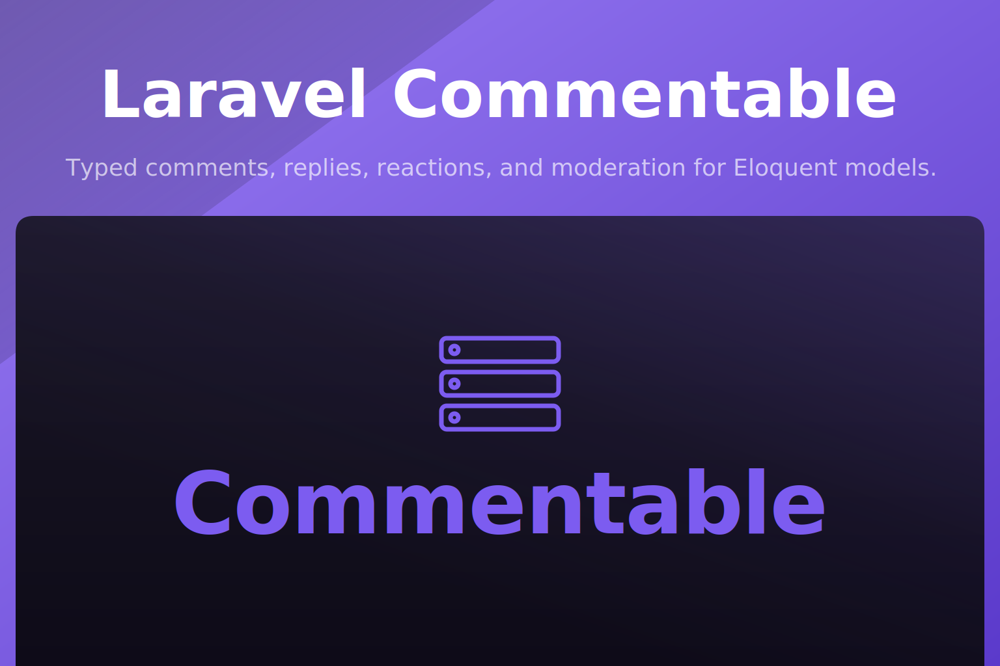

<p align="center">
  
</p>

<p align="center">
  <a href="https://packagist.org/packages/akira/laravel-commentable"></a>
  <a href="https://packagist.org/packages/akira/laravel-commentable"></a>
  <a href="https://github.com/akira-io/laravel-commentable/actions/workflows/run-tests.yml"></a>
  
  
</p>

Laravel Commentable is a lightweight comment system for Laravel applications. It adds comments, replies, reactions, and moderation to Eloquent models through small, typed traits.

## Install

```sh
composer require akira/laravel-commentable
```

```json
{
  "require": {
    "akira/laravel-commentable": "^0.1"
  }
}
```

Publish and run the migrations:

```sh
php artisan vendor:publish --tag="commentable-migrations"
php artisan migrate
```

Publish the config when you need custom table or model classes:

```sh
php artisan vendor:publish --tag="commentable-config"
```

## Quick start

```php
use Akira\Commentable\Concerns\Commentable;
use Akira\Commentable\Concerns\Commenter;
use Illuminate\Database\Eloquent\Model;
use Illuminate\Foundation\Auth\User as Authenticatable;

final class Post extends Model
{
    use Commentable;
}

final class User extends Authenticatable
{
    use Commenter;
}

$comment = $user->comment($post, 'Laravel 13 support is ready.');

$reply = $user->reply($comment, 'Confirmed with the package test suite.');

$post->comments()->where('approved', true)->get();
```

## Documentation

- [Roadmap](docs/00-roadmap.md)
- [Installation](docs/01-installation.md)
- [Basic usage](docs/02-basic-usage.md)
- [Advanced features](docs/03-advanced-features.md)
- [Configuration](docs/04-configuration.md)
- [API reference](docs/05-api-reference.md)
- [Database schema](docs/06-database-schema.md)
- [Testing](docs/07-testing.md)
- [Examples](docs/08-examples.md)
- [Troubleshooting](docs/09-troubleshooting.md)
- API reference: https://packages.akira-io.com/packages/laravel-commentable

## Testing

```sh
composer test
```

## Changelog

Please see [CHANGELOG.md](CHANGELOG.md) for what has changed recently. The changelog is generated from conventional commits via [git-cliff](https://git-cliff.org) on every release tag.

## Contributing

Please see [CONTRIBUTING.md](CONTRIBUTING.md) for details.

## Security Vulnerabilities

Please review [our security policy](SECURITY.md) on how to report security vulnerabilities.

## Credits

- [Kidiatoliny](https://github.com/kidiatoliny)
- [All Contributors](https://github.com/akira-io/laravel-commentable/graphs/contributors)

## License

The MIT License (MIT). Please see [LICENSE.md](LICENSE.md) for more information.
